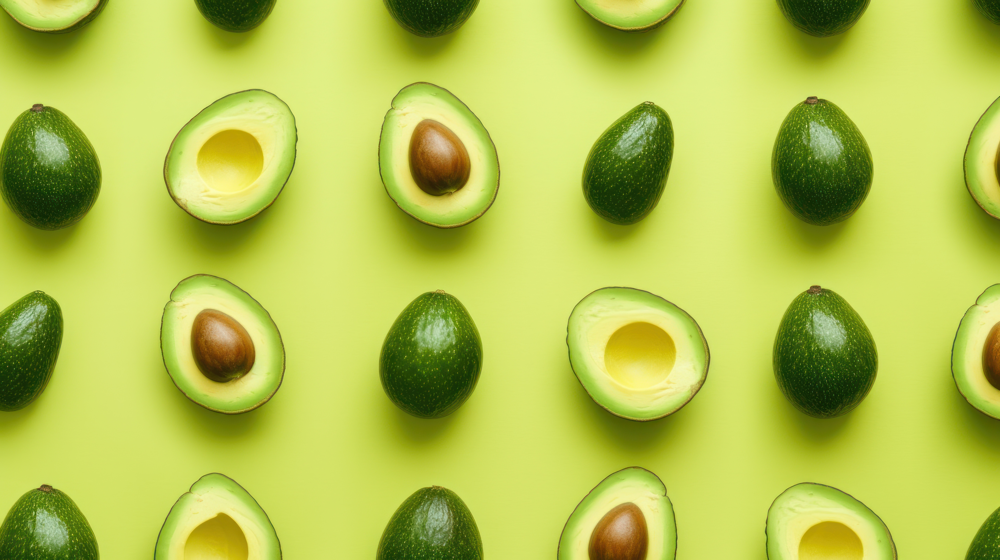

 

-- <cite>"https://www.vecteezy.com/free-photos/avocado-seamless"</cite>

# Exploratory Data Analysis in Python
 
The purpose of the project is to give insight into overall avocado sale trends throughout U.S. regions and suggest what I would explore further if someone were to potentially dive deeper into the causes.

## Data Set Used

 - [Avocado Sales](https://www.kaggle.com/datasets/valentinjoseph/avocado-sales-20152021-us-centric/data)

## Environment Used

- ```PostgreSQL```

- VS Code running ```SQL```

## Research Questions & Answers
 
1. [What regions sold the most amount of bags?]
   1. ``West``
   2. ``Northwest``
   3. ``SouthCentral`` 
   4. ``California`` 
   5. ``Southeast``

2. [Which year sold the most bags of avocados?]
    - ``2017``

3. [What is the total number of bags sold by type?]
    - Conventional: ``5.01 Billion``
    - Organic:      ``404  Million``

4. [What region sold the most amount of single avocados based on their size?]
    - Small/Medium: ``SouthCentral``
    - Large:        ``Northeast``
    - X-Large:      ``GreatLakes`` 

5. [What region sold the most amount of avocado bags based on their size?]
    - Small/Medium: ``California``
    - Large:        ``West``
    - X-Large:      ``GreatLakes`` 

6. [What was the average price of an avocado?]
    - ``$1.42``

7. [What was the average price of an avocado for each region?]
    -  This is a long listed answer and it is better to print out to see for yourself.

8. [What was the average price of an avocado for each region per year?]
    -  This is a long listed answer and it is better to print out to see for yourself.

9. [What was the average price of an avocado for each region per year based on the type?]
    -  This is a long listed answer and it is better to print out to see for yourself.

## Suggestions

- Why are avocados so popular in the West coast compared to the East?

- What happened in 2017 that caused avocado sales to peak?

- Can organic avocados potentially compete with conventional sales in the near future?

- Is there a reason why some regions by more of one type of avocado over another? 

- How has the price of avocados changed over time? 
